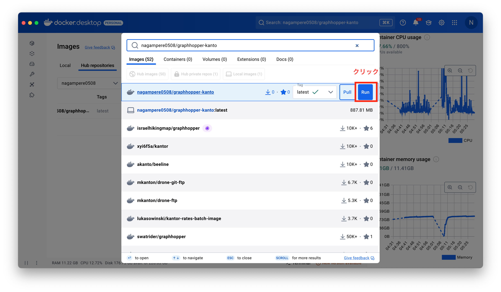
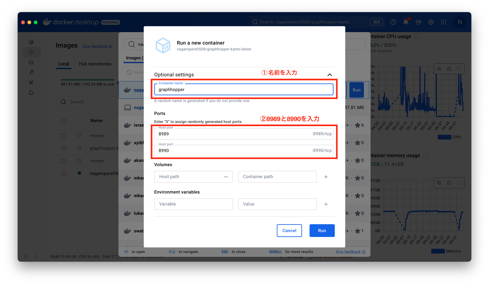
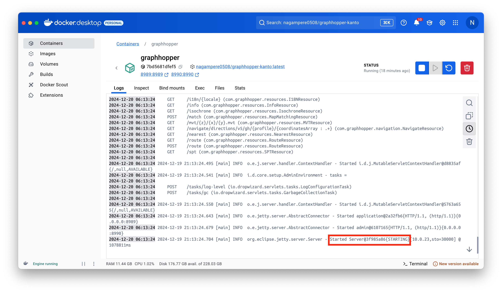
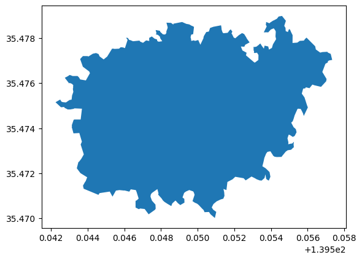

# graphhopper-kanto

到達圏算出ソフトgraphhopperの起動方法と利用方法

## 必要なソフトウェア
- docker desktop

※ Dockerとは？

Dockerは、ソフトウェアを仮想環境で実行するためのプラットフォームである。軽量なコンテナ技術を利用し、アプリケーションとその依存関係をまとめてパッケージ化することで、開発環境と本番環境の違いを解消し、一貫した動作を保証する。仮想マシンより効率的で、簡単に移植・スケーリングが可能。

例:

あるデザイナーが、ホームページを作成するために「WordPress」を使いたい。
通常、WordPressを使うには、サーバーやデータベースの設定、WordPress自体のインストールが必要で、初心者には難しい。

→Dockerを使えば、「WordPressを動かすための必要な設定すべて」が入ったパッケージ（Dockerイメージ）を1回ダウンロードして、以下のコマンドを実行するだけでホームページをすぐに動かすことができる。

詳しい説明は「[Dockerがわからない人へ。これ1本で0から学べる丁寧なDocker入門](https://qiita.com/Sicut_study/items/4f301d000ecee98e78c9)」などを参照

## dockerの設定
Setting > Resources > Advancedで、dockerに割り当てるCPU・メモリを設定する。

最低でも、CPUに4、メモリに8GBを割り当てる。

## 起動方法
### docker cloudからビルド場合(推奨)

- docker desktop で操作する場合
  1. docker desktopを起動後、上部のSearchで「nagampere0508/graphhopper-kanto」と検索しRunをクリック
  
  2. コンテナの名前を入力し(①)、ポート番号にそれぞれ8989と8990と入力する。
  
  3. 「Started Server」と表示されて、サーバーが起動するまで待つ
  

- bashを使う場合
```bash
docker run -p 8989:8989 nagampere0508/graphhopper-kanto --host 0.0.0.0
```

### Githubからディレクトリを複製してビルドする場合
- config-gh：graphhopperの機能を編集可能
- config-others：javaの領域と対象地域の編集、デフォは4ギガ、関東地方
```bash
# Githubからディレクトリのclone
cd <任意の作業ディレクトリ>
git clone https://github.com/nagampere/graphhopper-kanto.git

# docker imageのbuild
cd graphhopper-kanto
sh build.sh 
# docker containerの起動
docker run -p 8989:8989 graphhopper-kanto -c config-gh.yml --host 0.0.0.0
```

## 利用方法
dockerで起動しているアプリケーションは、localhost機能を使ってhttp経由で利用することができる。

### ブラウザ上で動作確認する
- [http://localhost:8989](http://localhost:8989)にアクセス

- [localhost:8989/maps/isochrone/index.html](localhost:8989/maps/isochrone/index.html)にアクセス


### requests.getでデータを取得する
使い方は[graphhopper API](https://docs.graphhopper.com)とほぼ同じ。

相違点は、①ベースURLの"https://graphhopper.com/api/1"が"http://localhost:8989"に変更、②APIキーを入れる"key"クエリを省略

例：python
``` python
import requests
base_url = 'http://localhost:8989/isochrone'

# クエリの設定
query = {
  "point": "35.475090001366574,139.54998499885238", # 基準地点
  "time_limit": "600", # 到達時間
  # "distance_limit": "400", # 到達圏は400mに設定
  "profile": "foot", # 移動手段
  "reverse_flow": "false" # 基準地点が目的地か否か
}

response = requests.get(base_url, query)
print(response.json())
```

```
{'polygons': [{'type': 'Feature',
   'geometry': {'type': 'Polygon',
    'coordinates': [[[139.5506159, 35.475471049999996],
      [139.55045719999998, 35.4756573],
      # ...他のデータ...
      [139.5506159, 35.475471049999996]]]},
   'properties': {'bucket': 0}}],
 'info': {'copyrights': ['GraphHopper', 'OpenStreetMap contributors'],
  'took': 567,
  'road_data_timestamp': '2024-12-18T21:20:41Z'}}
```

```python
import geopandas as gpd

features = response.json()['polygons']

gdf = gpd.GeoDataFrame(
  geometry = gpd.GeoDataFrame.from_features(features).geometry,
  crs = 'EPSG:4326'
)

gdf.plot()
```
