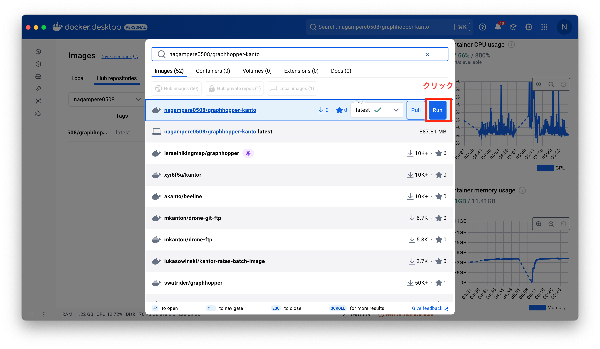
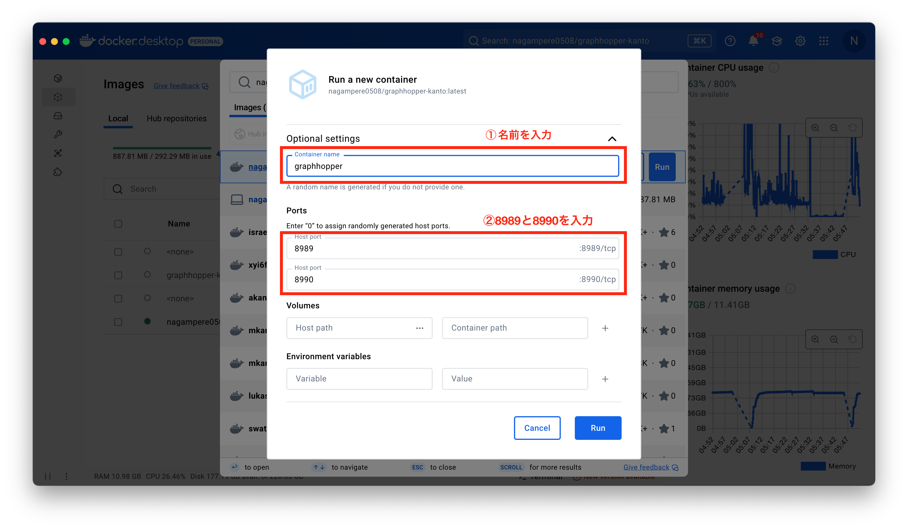
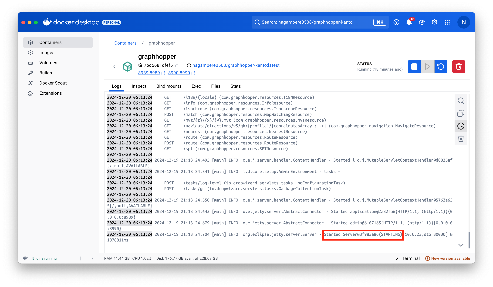
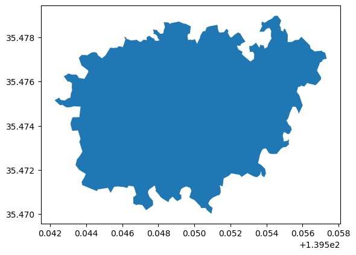

# graphhopper-kanto

到達圏算出ソフトgraphhopperの起動方法と利用方法

## 必要なソフトウェア

- [docker desktop](https://docs.docker.jp/desktop/install.html)

※ Dockerとは？

Dockerは、ソフトウェアを仮想環境で実行するためのプラットフォームである。軽量なコンテナ技術を利用し、アプリケーションとその依存関係をまとめてパッケージ化することで、開発環境と本番環境の違いを解消し、一貫した動作を保証する。仮想マシンより効率的で、簡単に移植・スケーリングが可能。

例:

あるデザイナーが、ホームページを作成するために「WordPress」を使いたい。
通常、WordPressを使うには、サーバーやデータベースの設定、WordPress自体のインストールが必要で、初心者には難しい。

→Dockerを使えば、「WordPressを動かすための必要な設定すべて」が入ったパッケージ（Dockerイメージ）を1回ダウンロードして、以下のコマンドを実行するだけでホームページをすぐに動かすことができる。

詳しい説明は「[Dockerがわからない人へ。これ1本で0から学べる丁寧なDocker入門](https://qiita.com/Sicut_study/items/4f301d000ecee98e78c9)」などを参照

## dockerの設定

Setting > Resources > Advancedで、dockerに割り当てるCPU・メモリを設定する。

最低でも、CPUに4、メモリに8GBを割り当てる。

## 起動方法

### docker cloudからビルド場合(推奨)

- docker desktop で操作する場合
  1. docker desktopを起動後、上部のSearchで「nagampere0508/graphhopper-kanto」と検索しRunをクリック
  
  2. コンテナの名前を入力し(①)、ポート番号にそれぞれ8989と8990と入力する(②)。
  
  3. 「Started Server」と表示されて、サーバーが起動するまで15分ほど待つ
  

- bashを使う場合
  
```bash
docker run -p 8989:8989 nagampere0508/graphhopper-kanto --host 0.0.0.0
```

### Githubからディレクトリを複製してビルドする場合

- .env：環境変数、デフォはgraphhopper-kanto

```bash
# Githubからディレクトリのclone
cd <任意の作業ディレクトリ>
git clone https://github.com/nagampere/graphhopper-kanto.git

# docker imageのbuild
docker compose build --no-cache graphhopper
# docker containerの起動
docker compose up -d graphhopper 
```

### 対象地域を変更する場合

.envファイルの`REGION`の値を変更する。

```
# 対象地域名（例：hokkaido, tohoku, kanto, chubu, kansai, chugoku, shikoku, kyushu）
REGION=kanto
# Dockerイメージのタグ（例：latest, v5.0, v6.0など）
TAG=latest
# Javaのオプション設定（メモリ設定）
JAVA_OPTS=-Xmx1g -Xms1g
```

### アプリケーションの停止

```bash
# docker desktopで操作する場合
docker desktopを起動後、Containers/Appsでgraphhopper-kantoを選択し、Stopをクリック  
# bashを使う場合
docker stop <コンテナIDまたはコンテナ名>
``` 


### トラブルシューティング

#### エラー: `Unexpected version for 'geometry'` が出る場合

`java.lang.IllegalStateException: Unexpected version for 'geometry'. Got: X, expected: Y` は、GraphHopperのバージョンが変わったとき（TAG更新、設定変更など）に既存のグラフキャッシュとの互換性がなくなることで発生します。

**対処法: Docker volumeを初期化する**

```bash
# コンテナを停止してボリュームを削除
docker compose down -v

# 再起動（グラフを再生成）
docker compose up -d graphhopper
```

※ `-v` オプションでボリュームを削除すると、ダウンロード済みのOSMデータやグラフキャッシュがすべて削除されます。次回起動時に再ダウンロード・再生成が行われます（15分程度）。

**グラフキャッシュのみを削除する場合:**

```bash
docker compose down
docker run --rm -v graphhopper_data:/data alpine sh -c 'rm -rf /data/default-gh'
docker compose up -d graphhopper
```

## 利用方法

dockerで起動しているアプリケーションは、localhost機能を使ってhttp経由で利用することができる。

### ブラウザ上で動作確認する

- [http://localhost:8989](http://localhost:8989)にアクセス

- [http://localhost:8989/maps/isochrone/index.html](http://localhost:8989/maps/isochrone/index.html)にアクセス


### requests.getでデータを取得する

使い方は[graphhopper API](https://docs.graphhopper.com)とほぼ同じ。

相違点は、①ベースURLの`https://graphhopper.com/api/1` が`http://localhost:8989` に変更、②APIキーを入れる"key"クエリを省略

例：python

``` python
import requests
base_url = 'http://localhost:8989/isochrone'

# クエリの設定
query = {
  "point": "35.475090001366574,139.54998499885238", # 基準地点
  "time_limit": "600", # 到達時間は600秒に設定
  # "distance_limit": "400", # 到達距離は400mに設定
  "profile": "foot", # 移動手段
  "reverse_flow": "false" # 基準地点が出発ならfalse、**到着地ならtrue**
}

response = requests.get(base_url, query)
print(response.json())
```

```
{'polygons': [{'type': 'Feature',
   'geometry': {'type': 'Polygon',
    'coordinates': [[[139.5506159, 35.475471049999996],
      [139.55045719999998, 35.4756573],
      # ...他のデータ...
      [139.5506159, 35.475471049999996]]]},
   'properties': {'bucket': 0}}],
 'info': {'copyrights': ['GraphHopper', 'OpenStreetMap contributors'],
  'took': 567,
  'road_data_timestamp': '2024-12-18T21:20:41Z'}
}
```

```python
import geopandas as gpd

features = response.json()['polygons']

gdf = gpd.GeoDataFrame(
  geometry = gpd.GeoDataFrame.from_features(features).geometry,
  crs = 'EPSG:4326'
)

gdf.plot()
```



## 設定方法

- config-gh.yml：graphhopperの機能を編集可能
- config-others.yml：javaの領域と対象地域の編集、デフォは4ギガ、関東地方
- custom_models/bike-japan.json：自転車ルート探索のための日本向け設定ファイル
- custom_models/car-japan.json：車ルート探索のための日本向け設定ファイル
- custom_models/foot-japan.json：徒歩ルート探索のための日本向け設定ファイル

### カスタムモデル（custom_model_files）の読み込み元

`config-gh.yml` の `profiles[*].custom_model_files` に書いたファイル名は、主に以下のどちらかから読み込まれます。

- このリポジトリの `custom_models/`（日本向けに調整したモデル）
- GraphHopper同梱の `graphhopper/core/src/main/resources/com/graphhopper/custom_models/`（例: `bike_elevation.json`, `foot_elevation.json` など）

※ どちらから読むかが分かりづらい場合は、`config-gh.yml` で `custom_models.directory: custom_models` を有効化すると、`custom_models/` 配下を参照する運用に寄せられます。

### foot-japan.json

交通手段が徒歩(`foot`)の場合のgraphhopperのルート探索に使う道路データの設定ファイル。

移動速度は道路（edge）ごとに入る平均速度の定義は graphhopper/core/src/main/java/com/graphhopper/routing/util/parsers/FootAverageSpeedParser で「OSMタグから edge ごとに km/h を入れる」形です。

- 基本速度（定数）: MEAN_SPEED = 5、SLOW_SPEED = 2（km/h想定）
- 通常の道路（sac_scale なし）:
  - highway=steps → 5 - 2 = 3
  - それ以外 → 5
- 登山系タグ（sac_scale あり）:
  - sac_scale=hiking → 5
  - それ以外（例: mountain_hiking 等）→ 2
- highway タグが無い way の扱い:
  - フェリー（route=ferry または route=shuttle_train）ならフェリー速度を設定
  - ただし railway=platform または man_made=pier 以外はそこで処理終了（速度は設定されない）

計算上の速度は、この平均速度に `multiply_by` の値をかけたものになります。日本の場合は、バスサービスハンドブックを参考に、80m/分=4.8km/hを基準速度とし、徒歩優先度(`foot_priority`)をかける形にしています。

```json
{
  "priority": [
    { "if": "!foot_access || hike_rating >= 2", "multiply_by": "0" },
    { "else": "", "multiply_by": "foot_priority"},
    { "if": "country == DEU && road_class == BRIDLEWAY && foot_road_access != YES", "multiply_by": "0" },
    // note that mtb_rating=0 is the default and mtb_rating=1 corresponds to mtb:scale=0 and so on
    { "if": "mtb_rating > 3", "multiply_by": "0.7" }
  ],
  "speed": [
    { "if": "true", "limit_to": "foot_average_speed" },
    { "if": "true", "multiply_by": "0.96" }
  ]
}
```

### car-japan.json

交通手段が車(`car`)の場合のgraphhopperのルート探索に使う道路データの設定ファイル。

移動速度は道路（edge）ごとに入る平均速度（単位は km/h 想定）です。定義は graphhopper/core/src/main/java/com/graphhopper/routing/util/parsers/CarAverageSpeedParser.java にあり、デフォルトは highway タグから以下のように決まります（抜粋）:

- `motorway`: 100
- `motorway_link`: 70
- `trunk`: 70
- `trunk_link`: 65
- `primary`: 65
- `secondary`: 60
- `tertiary`: 50
- `unclassified`/`residential`: 30
- `service`: 20
- `living_street`/`pedestrian`: 6
- `track`: 15（tracktype=grade1: 20
- `grade2`: 15
- `grade3`: 10）
- 未知の highway: 10

補正も入ります:

- maxspeed があれば、その 0.9倍（例: maxspeed=50 → 45km/h、最低1km/h）
- surface が悪路（gravel/cobblestone/泥など）で、かつ速度が30超なら 30km/h に上限

計算上の速度は、この平均速度に `multiply_by` の値をかけたものになります。日本の場合は、信号機などの影響を考慮するため `multiply_by` を0.5に設定しています。

```json
{
  "distance_influence": 90,
  "priority": [
    { "if": "!car_access", "multiply_by": "0" }
  ],
  "speed": [
    // Then cap to the encoded car_average_speed if present
    { "if": "true", "limit_to": "car_average_speed" },
    { "if": "true", "multiply_by": "0.5" }
  ]
}
```

### bike-japan.json 

graphhopperのルート探索に使う道路データの設定ファイル。

移動速度は道路（edge）ごとに入る平均速度（単位は km/h 想定）です。定義は graphhopper/core/src/main/java/com/graphhopper/routing/util/parsers/BikeAverageSpeedParser.java にあり、以下のように決まります:

- 基本値（km/h想定）
  - PUSHING_SECTION_SPEED = 4（押し歩き扱い）
  - MIN_SPEED = 2（下限）
- highway から初期速度（例）
  - `cycleway`: 18
  - `residential`: 18
  - `unclassified`: 16
  - `track`: 12
  - `service`: 12
  - `road`: 12
  - `path/footway/pedestrian/platform/bridleway`: 6
  - `living_street`: 6
  - `steps`: 2
  - 幹線系（primary〜motorway 等）も基本は 18（“特殊ケース”として扱い）
- 押し歩き（4km/h）に落とす条件（一部）
  - `bicycle=dismount`
  - `railway=platform`
  - `vehicle` が private 等の制限値で、かつ bicycle=intended でない
  - `service` で、自転車指定（ルートネットワーク or designated）でない
  - `surface=*` が付いているのに未知の `surface`（＝速度推定できない）

計算上の速度は、この平均速度に `multiply_by` の値をかけたものになります。日本の場合は、信号機などの影響を考慮するため、`multiply_by` を0.7に設定しています。

```json
{
  "priority": [
    { "if": "true",  "multiply_by": "bike_priority" },
    { "if": "mtb_rating > 2",  "multiply_by": "0" },
    { "if": "hike_rating > 1",  "multiply_by": "0" },
    { "if": "country == DEU && road_class == BRIDLEWAY && bike_road_access != YES", "multiply_by": "0" },
    { "if": "!bike_access && (!backward_bike_access || roundabout)",  "multiply_by": "0" },
    { "else_if": "!bike_access && backward_bike_access",  "multiply_by": "0.2" }
  ],
  "speed": [
    { "if": "true", "limit_to": "bike_average_speed" },
    { "if": "true", "multiply_by": "0.7" },
    { "if": "!bike_access && backward_bike_access", "limit_to": "6" }
  ]
}
```

### 勾配（average_slope）の影響

勾配（`average_slope`）の影響は「勾配値を作る処理（import時）」と「その値を使って速度を補正する custom model（routing時）」に分かれます。

#### 勾配値の定義（import時）

- 実装: `graphhopper/core/src/main/java/com/graphhopper/routing/util/SlopeCalculator.java`
- `point_list`（標高付き）から、2D距離 $d$（m）と標高差 $\Delta h$（m）を使って次で計算します（単位感は m/100m）。
  - `average_slope = Δh * 100 / d`
- 短すぎる edge（`distance2D < 8m`）や標高なし（2D）は 0 扱いになります。
- 進行方向に対して、登りが正・下りが負になるように扱われます（`graphhopper/core/src/main/java/com/graphhopper/routing/ev/AverageSlope.java` の仕様）。

#### 速度への反映（routing時, custom model）

`config-gh.yml` の `custom_model_files` に含まれる elevation 用モデルで、`average_slope` を見て速度を抑制/増加します。

- 徒歩: `graphhopper/core/src/main/resources/com/graphhopper/custom_models/foot_elevation.json`
  - `average_slope >= 15` → `limit_to: 1.5`
  - `average_slope >= 7` → `limit_to: 2.5`
  - `average_slope >= 4` → `multiply_by: 0.85`
  - `average_slope <= -4`（下り）→ `multiply_by: 1.05`
- 自転車: `graphhopper/core/src/main/resources/com/graphhopper/custom_models/bike_elevation.json`
  - `average_slope >= 15` → `limit_to: 3`
  - `average_slope >= 12` → `limit_to: 6`
  - `average_slope >= 8` → `multiply_by: 0.80`
  - `average_slope >= 4` → `multiply_by: 0.90`
  - `average_slope <= -4`（下り）→ `multiply_by: 1.10`
